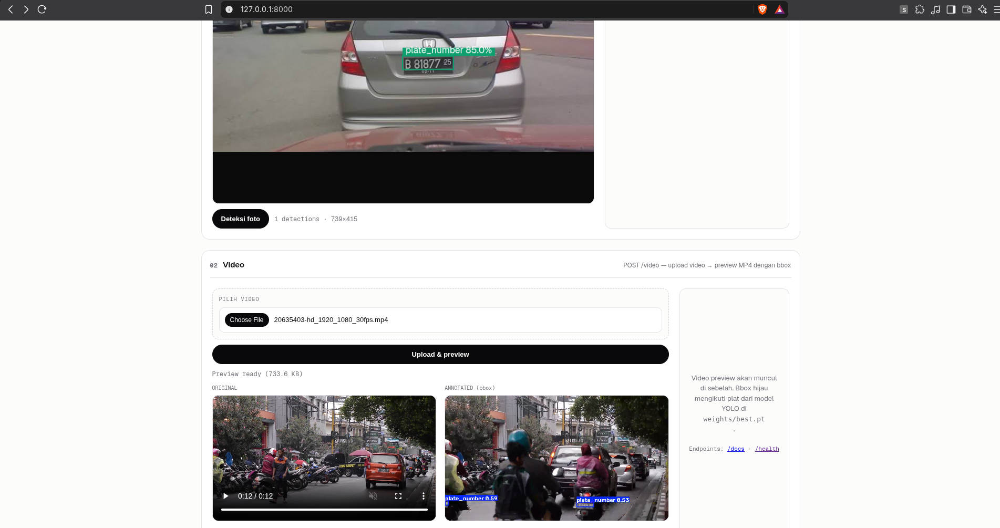

# Single Object Detection



Simulasi implementasi single-object detection menggunakan YOLO untuk mendeteksi lokasi plat nomor kendaraan pada gambar dan video.

Project ini menyediakan:

- Notebook training YOLO dengan dataset plat nomor Indonesia.
- Model hasil training pada `weights/best.pt`.
- Web app sederhana menggunakan FastAPI.
- Preview video dengan bounding box pada plat nomor.

## Batasan

Model saat ini hanya mendeteksi **lokasi plat nomor**. Sistem belum membaca teks nomor kendaraan atau OCR.

## Struktur Project

```text
.
├── app/
│   ├── main.py              # API FastAPI dan pemrosesan video
│   ├── model.py             # Loader dan inference model YOLO
│   └── templates/index.html # UI web
├── weights/
│   └── best.pt              # Model hasil training
├── plate_detection.ipynb    # Notebook persiapan dataset dan training
├── docs/
│   └── plate_detection.md   # Dokumentasi notebook
└── pyproject.toml
```

## Persiapan Environment

Pastikan Python dan `ffmpeg` tersedia.

Buat virtual environment:

```bash
python -m venv .venv
```

Install dependency CPU-only agar tidak mengunduh paket CUDA:

```bash
uv pip install --python .venv/bin/python \
  --index-url https://download.pytorch.org/whl/cpu \
  torch torchvision

uv pip install --python .venv/bin/python \
  fastapi uvicorn python-multipart opencv-python pillow numpy jinja2 \
  pyyaml matplotlib requests psutil polars tqdm cloudpickle \
  nvidia-ml-py ultralytics-platform ultralytics-thop

uv pip install --python .venv/bin/python ultralytics --no-deps
```

Jika tidak menggunakan `uv`, dependency dapat dipasang dengan `pip` sesuai environment masing-masing.

## Lokasi Model

Letakkan model hasil training pada:

```text
weights/best.pt
```

Model dimuat ketika aplikasi mulai. Jika file tidak ada, aplikasi akan berhenti dengan error yang jelas.

Verifikasi model:

```bash
.venv/bin/python -c "from app.model import model; print(model.ckpt_path)"
```

## Menjalankan Web App

```bash
.venv/bin/uvicorn app.main:app --reload
```

Buka halaman berikut:

- Web UI: <http://127.0.0.1:8000>
- API documentation: <http://127.0.0.1:8000/docs>
- Health check: <http://127.0.0.1:8000/health>

UI mendukung:

- Upload gambar dan melihat bounding box plat.
- Upload video dan melihat video hasil anotasi.
- Download video hasil dalam format MP4 H.264.

## Endpoint

### `GET /health`

Memeriksa status aplikasi dan path model yang sedang digunakan.

### `POST /detect`

Menerima gambar dan mengembalikan koordinat bounding box dalam JSON.

Contoh response:

```json
{
  "detections": [
    {
      "class": "plate_number",
      "confidence": 0.91,
      "bbox": [120, 80, 340, 145]
    }
  ],
  "count": 1
}
```

### `POST /video`

Menerima video, menjalankan deteksi pada frame video, menggambar bounding box, lalu mengembalikan video MP4 dengan codec H.264.

## Training

Training dilakukan melalui `plate_detection.ipynb`, idealnya menggunakan GPU Colab atau Kaggle.

Alur training:

```text
Dataset COCO
  -> Konversi annotation ke format YOLO
  -> Split train dan validation
  -> Training YOLO
  -> Evaluasi mAP, precision, dan recall
  -> weights/best.pt
```

Jalankan cell notebook dari awal secara berurutan. Setelah training selesai, salin file `best.pt` ke folder `weights/` pada project ini.

## Verifikasi Kode

```bash
.venv/bin/pyright app
.venv/bin/python -m pip check
.venv/bin/python -m compileall -q app
```

## Alur Sistem

```text
User upload gambar/video
        -> FastAPI menerima file
        -> OpenCV membaca gambar/frame
        -> YOLO memprediksi lokasi plat
        -> Server menggambar bounding box
        -> UI menampilkan hasil
```

Inference dilakukan menggunakan CPU pada environment lokal. Untuk training, gunakan GPU cloud karena training YOLO di CPU membutuhkan waktu jauh lebih lama.
